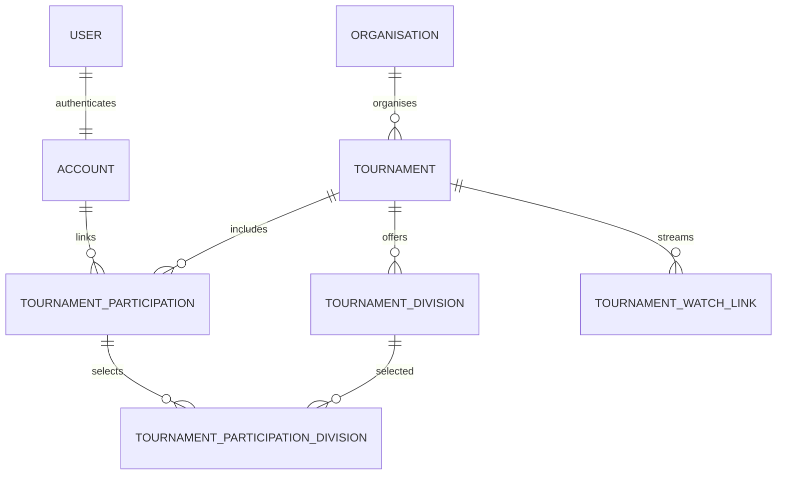

# BVB Project — Tournament calendar and multiple divisions

Implementation plan adapting [API issue #76](https://github.com/romalopes/beachvolleyballproject_api/issues/76) to the current repositories.

Reviewed: 7 October 2026. This is a proposed implementation plan, not an implemented feature or a verification of production deployments.

## 1. Recommendation

Reuse the existing `Organisation`, `User`, `Account`, authentication, role checks, pagination and custom calendar infrastructure. Add `Tournament`, `TournamentDivision`, `TournamentParticipation`, `TournamentParticipationDivision` and `TournamentWatchLink`.

Separate three concepts:

| Concept | Field/model | Example |
| --- | --- | --- |
| Who organises the event? | `Tournament.organisation_id` → existing `Organisation` | Volleyball NSW |
| What geographical/competitive scope is it? | `Tournament.scope` | State |
| Which playing divisions does it offer? | Multiple `TournamentDivision` records | B, BB, BBB, A, AA, AAA, AAAA; or Division 1, 2, 3 |

**A tournament does not have one playing-level enum.** It has many divisions. The tournament scope is independent of these divisions and independent of `Organisation.organisation_type`.

Use one division naming scheme per tournament initially: `letter` or `numbered`. Different tournaments can use different schemes. Do not automatically equate Division 1 with AAAA: the organisers define their competitions, and there is no reliable universal conversion.

Letter strength from lowest to highest is **B < BB < BBB < A < AA < AAA < AAAA**. Numbered strength is the reverse of the number: **Division 1 is highest**, then Division 2, Division 3, etc.

## 2. What is already implemented

The default `main` branches were inspected directly, including schema, models, controllers, routes, API client, navigation and calendar code.

| Repository | Reviewed commit |
| --- | --- |
| [API](https://github.com/romalopes/beachvolleyballproject_api) | `ce5aa1ea2711ad89f9a8652ae923b9a49c2c8f38` |
| [React frontend](https://github.com/romalopes/beachvolleyballproject) | `054fba328750f1f447f4846cfa0121848e19fae7` |

These commits are evidence anchors. Before implementing, compare them with the developer's current checkout and refresh the audit if code has changed.

| Area | Verified state | Adaptation |
| --- | --- | --- |
| Tournament feature | No tournament tables, models, API routes or React pages in the inspected application code. References in comments/deletion warnings are future placeholders. | Build the tournament feature; do not invent an existing tournament migration/backfill. |
| Backend | Rails 8.1, PostgreSQL, Rails controllers and Minitest | Follow these conventions; do not introduce a second API framework or RSpec suite. |
| Organisation | `Organisation`, `organisations`, `/api/v1/organisations`; hierarchy, acronym, slug, logo, active/archived state and case-insensitive unique name already exist | Reuse British spelling and existing hierarchy. Do not create `Organization` or `organizations`. |
| Organisation fields | `website_url` and `country` are absent from the reviewed organisation table | Add optional columns only if needed; extend existing forms and serialization without rewriting the entity. |
| Organisation permissions | Catalogue is staff-gated; show is available to content managers or active members. Create/re-parent/delete are admin-only; some edits are delegated. | Do not make the existing organisation catalogue or roster public just to display an organiser. |
| Identity | `User has_one Account`; Account owns `ContactDetail`, multiple player/coach profiles and memberships | Resolve self-service tournament identity through `Current.user.account`. No new Person dependency. |
| Legacy identity | Person-related code and compatibility records remain in parts of the application | Do not make tournament work depend on removing all legacy Person code. |
| Roles | Runtime predicates are `admin?`, `curator?`, `coach?`, `player?`; assignments remain on User | Use actual roles. The issue's generic “Super User” maps to the existing `admin` authority; no verified `super_user` role. |
| Auth | Session cookie or API bearer token; `Current.user` is effective user, `Current.real_user` is authenticating user | Preserve session handling and impersonation semantics. |
| API base | `Api::V1::ApplicationController`, including the private TestAccess gate | New controllers inherit the namespace base and preserve the gate. |
| Serialization | Explicit Rails JSON/metadata methods; shared `Pagination` concern | Follow current response style; no separate serializer library required. |
| Pagination | `{ data, meta: { page, per_page, total, total_pages } }`; default 20, maximum 100 | Reuse for tournament lists and implement complete calendar-page loading. |
| Frontend | React 19, TypeScript, Vite, React Router, Vitest/Testing Library | Extend current application rather than generating another frontend. |
| API client | `src/api.ts`, auth/error handling, private gate token, `normalizePaginatedResponse` | Add tournament methods using those helpers. |
| Calendar | `/calendar` → `src/pages/TrainingCalendar.tsx`; month/week, custom grid, `src/utils/calendar.ts` | Preserve training calendar. Add tournament month/list views using reusable grid utilities. No calendar dependency needed initially. |
| Navigation | Grouped `src/components/Sidebar.tsx` and routes in `src/App.tsx` | Add a tournament destination outside staff-only Community links. |
| Media | `Video`/polymorphic `VideoReference` exists for reusable instructional/session video | Watch links have distinct live-stream/provider semantics; keep `TournamentWatchLink` rather than modifying shared Video behaviour. |
| Player level | PlayerProfile currently has a string `level` | Do not replace or synchronize player-level fields as part of this feature. |

Primary source examples:

- [Organisation model](https://github.com/romalopes/beachvolleyballproject_api/blob/ce5aa1ea2711ad89f9a8652ae923b9a49c2c8f38/app/models/organisation.rb)
- [Account model](https://github.com/romalopes/beachvolleyballproject_api/blob/ce5aa1ea2711ad89f9a8652ae923b9a49c2c8f38/app/models/account.rb)
- [User model](https://github.com/romalopes/beachvolleyballproject_api/blob/ce5aa1ea2711ad89f9a8652ae923b9a49c2c8f38/app/models/user.rb)
- [Organisation controller](https://github.com/romalopes/beachvolleyballproject_api/blob/ce5aa1ea2711ad89f9a8652ae923b9a49c2c8f38/app/controllers/api/v1/organisations_controller.rb)
- [Schema](https://github.com/romalopes/beachvolleyballproject_api/blob/ce5aa1ea2711ad89f9a8652ae923b9a49c2c8f38/db/schema.rb)
- [Training calendar](https://github.com/romalopes/beachvolleyballproject/blob/054fba328750f1f447f4846cfa0121848e19fae7/src/pages/TrainingCalendar.tsx)
- [API client](https://github.com/romalopes/beachvolleyballproject/blob/054fba328750f1f447f4846cfa0121848e19fae7/src/api.ts)

## 3. Changes to the original issue plan

| Original issue direction | Revised direction |
| --- | --- |
| Create an Organization model | Reuse existing Organisation and its management pages. |
| Tournament `level = club/state/national/international/other` | Rename that concept to `scope`, reserving division/playing level for competition strength. |
| Divisions deferred | Divisions are now a required first-release feature. |
| User-linked participation | Use an Account-owned tournament association reached through the authenticated User, consistent with the implemented domain identity. |
| One relationship per tournament | One relationship per Account/tournament plus zero or more selected divisions. |
| Admin/Super User | Existing admin role, without inventing a new role. |
| Generic calendar component | Reuse current custom grid utilities and UI patterns; preserve `/calendar`. |
| Public organisation read | Expose a small organiser summary in public tournament responses; preserve existing organisation permissions. |
| Starts-within-range filtering | Query all tournaments overlapping the visible range, including those starting before it. |
| Computed status only | Keep computed temporal status; add separate persisted cancellation/archive state for real organiser changes. |

## 4. Scope and decisions

### Required first release

- Tournament directory, month calendar and list view; detail pages; search and combined filters.
- Multiple letter or numbered divisions per tournament, configurable by an admin.
- One organiser from the existing organisation table.
- Start/end time, explicit event timezone, location, description and website.
- Account self-link/unlink, role selection and optional multiple division selections.
- My Tournaments.
- Multiple ordered watch links.
- Admin tournament/division/watch-link management; use existing organisation management.
- Read-only tournament discovery for unauthenticated visitors, while preserving the deployment's private test-access gate.
- Validation, authorization, timezone, race-condition and frontend coverage.

### Deferred

Teams, partner matching, registration/payment, brackets, draws, court scheduling, scoring, results, ranking calculations, imports and automated eligibility checking. A tournament link expresses a user's interest/attendance intent; it does **not** confirm official tournament registration or reserve a place.

Gender and age categories can be a later extension. The initial division row is one playing-strength option. Do not silently treat Men's A and Women's A as duplicate-free categories without modelling that dimension.

Organisation-restricted tournament discovery can be added later using active Account memberships and an explicit visibility policy. Do not apply profile-claim boundaries to public tournament browsing, and do not infer access from an organisation's ancestors. The initial release implements the public directory specified by issue #76.

### Lifecycle

Tournament `publication_state`: `active`, `cancelled`, `archived`, default active. Active records can be publicly read; cancelled records remain discoverable with a cancellation notice; archived records are excluded from public lists/show and My Tournaments, but retained for admin history. Ordinary dates do not change publication state.

`temporal_status`, calculated from one captured current time: upcoming before start, ongoing from start until end, completed at/after end. A cancelled tournament can therefore also be temporally upcoming. Display cancellation first; do not present it as an ordinary upcoming event.

Only active, not-completed tournaments accept new self-links or division/role changes. Existing links remain readable for cancelled/completed records. Unlink remains available for the owner, including through a self-service endpoint that can resolve an archived parent without exposing its private details.

## 5. Domain model



The User/Account cardinality describes the intended identity model. Handle legacy Users without an Account explicitly rather than assuming the relation always exists.

### Tournament

| Column | Proposed type/rule |
| --- | --- |
| `name` | Required string; trimmed, bounded to 200 characters |
| `organisation_id` | Required FK to existing organisations; restrict organiser deletion |
| `scope` | Required string: club, state, national, international, other |
| `division_scheme` | Required string: letter or numbered |
| `starts_at`, `ends_at` | Required datetime instants; `ends_at > starts_at` |
| `timezone` | Required valid IANA zone, e.g. Australia/Sydney |
| `all_day` | Boolean, default false; explicit date-only display mode |
| `description` | Optional text; display safely using existing conventions |
| `location_name`, `city`, `state`, `country` | Optional bounded strings; `state` means location state, unrelated to scope |
| `website_url` | Optional validated HTTP/HTTPS URL |
| `publication_state` | Required active/cancelled/archived, default active |
| `created_by_account_id` | Required server-assigned Account FK for new records |
| timestamps | Standard created_at/updated_at |

Use `ends_at`, matching existing TrainingSession naming, instead of introducing a second finish-time convention. The stricter positive-duration rule deliberately replaces the original issue's equality allowance.

Scope values can use string inclusion/check constraints following current models. This finite scope classification is not the tournament's playing level. Avoid integer enum ordering as a public strength API.

Require at least one active division before making a newly created tournament available. MVP create/update sends tournament and divisions together in a transaction; there is no separate draft workflow. Removing the final active division is rejected. This is a cross-row business invariant, enforced in the mutation service while locking the parent; it is not expressible as a simple row CHECK constraint.

### TournamentDivision

| Column | Proposed type/rule |
| --- | --- |
| `tournament_id` | Required FK |
| `letter_level` | Nullable string, constrained to B/BB/BBB/A/AA/AAA/AAAA |
| `division_number` | Nullable positive integer, no fixed maximum competition count |
| `active` | Required boolean, default true |
| timestamps | Standard |

Exactly one of `letter_level` and `division_number` must be present. Enforce XOR in model and DB CHECK, including positive number/valid letter constraints. Parent scheme must match its children; validate in the mutation service under a tournament lock. Do not pretend a CHECK can reference another table.

Add partial unique indexes `(tournament_id, letter_level)` when letter is non-null, and `(tournament_id, division_number)` when number is non-null. Include inactive records in uniqueness: reactivate existing rows instead of creating duplicate historical division identities.

Derived API fields:

- `label`: AAAA, A, BB, or Division 1, Division 2.
- `strength_order`: 1 means strongest **within its naming scheme**. Letter mapping below; numbers use their value.
- Order by strength_order ascending, then ID. It is not a global player rating.

| Letter | Strength order |
| --- | --- |
| AAAA | 1 |
| AAA | 2 |
| AA | 3 |
| A | 4 |
| BBB | 5 |
| BB | 6 |
| B | 7 |

Examples: an event offering B, BBB and A returns A, BBB, B; an event offering Division 1, 3 and 5 returns 1, 3, 5. Gaps are allowed. Admin can select any subset of letter levels and any set of positive division numbers.

Changing a scheme is allowed only when no participation exists, using an atomic replacement of unused rows. After linking begins, lock the scheme. A division's code is immutable after it has been selected; deactivate it to retire it. Existing users see a retired label, but new selections cannot use it. Never automatically remap letters to numbers or change a PlayerProfile's level.

### TournamentParticipation

| Column | Proposed type/rule |
| --- | --- |
| `account_id` | Required FK to Account |
| `tournament_id` | Required FK to Tournament |
| `role` | Required string: participant, coach, spectator, volunteer, other |
| timestamps | Standard |

Unique database index `(account_id, tournament_id)`. This is an Account's self-declared relationship, not a team roster. One Account can be linked even if it has zero profiles; multiple profiles do not generate multiple participation rows.

Provide model associations on Account and Tournament. Resolve the Account server-side; reject or ignore forged ownership fields consistently with current APIs. Missing Account returns a clear 422; never create a replacement identity implicitly.

The issue suggested `user_id`; `account_id` is an intentional adaptation to the now-implemented Account domain identity. Auth/roles remain on User, and there is no `TournamentAccount` model or new club membership hierarchy.

### TournamentParticipationDivision

Columns: `tournament_participation_id`, `tournament_division_id`, `tournament_id`, timestamps. Unique `(tournament_participation_id, tournament_division_id)`.

The extra tournament_id supports DB enforcement that selected division and participation belong to the same tournament. Add unique parent keys `(id, tournament_id)` and composite FKs from `(tournament_participation_id, tournament_id)` and `(tournament_division_id, tournament_id)` to the respective parents. Use migration helpers supported by the actual Rails/PostgreSQL versions, or narrowly scoped SQL, and verify constraint round-tripping. Add ordinary model validations for readable errors too.

For initial role rules, participant and coach can optionally select multiple divisions; spectator/volunteer/other link at tournament level. Switching to a non-division role clears selections atomically. No role grants permissions: selecting coach here does not confer the Coach application role.

### TournamentWatchLink

Required tournament FK, `name`, `url`; optional `provider`, `description`, `starts_at`; required nonnegative `position`, default 0. Stable order by position then ID; duplicate positions are allowed. Provider is free text.

Validate HTTP/HTTPS URLs with a parsed host and no embedded credentials; reject javascript/data/file schemes. Open links safely in a new tab. Do not fetch previews server-side or auto-embed arbitrary providers. Live watch links are independent from existing VideoReference records.

### Organisation integration and deletion

Add `Organisation has_many :tournaments, dependent: :restrict_with_error`. Extend both `deletable?` and `deletable_blocker`, and **the bulk-count serialization path** (`deletable_with_counts?` and controller count aggregation), so the UI does not advertise a delete the server refuses. Preserve existing child/membership restrictions and archived organiser history.

Optional `website_url`/`country` additions go through existing organisation validations, permitted fields, metadata/API type and edit UI. No new organisation active boolean: current status already supplies lifecycle.

Archived organisers cannot be selected for newly created tournaments or substituted into edits. Existing tournaments retain their organiser and remain readable; archival must not cascade into tournament deletion or hide public history automatically.

Tournaments with links are archived/cancelled, not hard-deleted. Admin may hard-delete an unused mistake transactionally, including unused child divisions/watch links. Division rows referenced by selection rows cannot be hard-deleted. Self-unlink deletes the participation and its selection rows because these are directory preferences, not official results/history.

## 6. Dates, calendar queries and search

Use half-open intervals `[starts_at, ends_at)`. An all-day event on 10–12 October stores midnight 10 October through midnight 13 October **in the tournament's zone**, converted to instants. Display “10–12 October”; do not display the exclusive end as an additional day. Use timezone-aware next-day arithmetic so DST does not assume every day is 24 hours.

Timed inputs include explicit offsets and timezone. Validate local input round-trips: reject nonexistent DST wall times; for ambiguous local times require an explicit offset/choice. Never interpret an international tournament's time in the API server's default zone.

Calendar has an explicit display timezone, initially browser IANA timezone, shown in the UI. Timed events occupy the days their instants overlap in that display zone. All-day events keep their tournament-local date labels and occupy those named calendar dates. Include event timezone on detail and when it differs from the calendar's display zone.

Required overlap predicate for timed intervals:

```sql
starts_at < :range_end AND ends_at > :range_start
```

Request `starts_at_from` and `starts_at_to` as offset-bearing ISO-8601 instants; document that these name the visible window, not a start-only filter. Accept optional `display_timezone` for calendar all-day matching. To include all-day rows correctly, compare requested window's local date boundaries with event-local start/end dates; do not use only UTC overlap, which can exclude an all-day event shown in a distant display zone. A server-side query can branch all_day/timed and derive local dates with PostgreSQL AT TIME ZONE. Test extreme offsets and DST. An alternative bounded broad UTC prefilter plus correct date filtering must happen before pagination/counting and must have a documented bound.

The visible window includes leading/trailing grid days, not only the named month. Keep the training endpoint's semantics unchanged.

Lists are paginated. Calendar fetches **every page for its bounded visible range**, using meta.total_pages and stable `(starts_at, id)` ordering. Do not call normalizePaginatedResponse(...).data once and silently drop events beyond 100. Cancel/discard stale page sequences after range/filter changes; show a loading state until the complete requested result is ready. If a documented result ceiling is introduced later, show an explicit overflow state rather than claiming the calendar is complete.

Combine filters with AND; repeated choices within one filter use OR. Division filters must match the same child row, using EXISTS to avoid duplicate tournament rows and distorted counts. `letter_levels[]` matches only letter events; `division_numbers[]` matches only numbered events. Do not order or compare mixed schemes numerically.

Search name, organiser name/acronym, location_name/city/state/country. Use current PostgreSQL query patterns with bound parameters and escaped wildcard characters. No search engine dependency. Filters: scope, organiser, division scheme, selected levels/numbers, temporal status, location and mine. Capture current time once for consistent status filtering/serialization.

Index organiser, scope, publication_state, starts_at and ends_at; add `(organisation_id, starts_at)` where appropriate. Assess real query plans before adding trigrams/GiST or extra composite indexes.

## 7. Permissions and API contract

| Action | Guest | Signed-in Account owner | Coach/Curator | Admin |
| --- | --- | --- | --- | --- |
| Read non-archived tournament directory/details/divisions/watch links | Yes, subject to private gate | Yes | Yes | Yes |
| Read own link/division selections | No | Yes | Own only | Own, plus explicit administrative use |
| Link/update/unlink self | Sign-in action | Yes under lifecycle rules | Own only | Own only on self endpoint |
| Create/edit tournament, divisions, watch links | No | No | No by default | Yes |
| Cancel/archive/restore tournament | No | No | No by default | Yes |
| Hard-delete unused tournament | No | No | No | Yes |
| Manage organisation/roster | Existing rules | Existing rules | Existing rules | Existing rules |

Use existing admin authorization behaviour based on Current.real_user for official management, and Current.user.account for self-service participation. During impersonation, admin-management acts with real administrative authority; self-linking acts for the effective Account. Record attribution and audit consistently with the actual app convention; where logging is added include both actor identities. Tests must pin these behaviours. Do not reuse content_manager? for tournament administration: it grants coaches and curators wider access than requested.

Future granular permission identifiers can be documented as `tournaments.manage`, etc., but do not assume the separate roles-permissions plan is implemented. Use its checks if they exist at implementation time, otherwise current admin predicates.

Proposed endpoints:

| Method | Path | Purpose |
| --- | --- | --- |
| GET | `/api/v1/tournaments` | Paginated search/window/filter/mine listing |
| GET | `/api/v1/tournaments/options` | Scopes, schemes, ordered levels and participation roles |
| GET | `/api/v1/tournaments/:id` | Detail, organiser summary, divisions, watch links, caller's link |
| POST/PATCH/DELETE | `/api/v1/tournaments[/:id]` | Admin management; unused-record delete only |
| POST | `/api/v1/tournaments/:id/cancel` | Cancel without destroying data |
| POST | `/api/v1/tournaments/:id/archive` | Hide public record, retain history |
| POST | `/api/v1/tournaments/:id/restore` | Admin restoration; revalidate active-divisions invariant |
| POST/PATCH/DELETE | `/api/v1/tournaments/:id/divisions[/:division_id]` | Admin division management/deactivation |
| POST/PATCH/DELETE | `/api/v1/tournaments/:id/watch_links[/:watch_link_id]` | Admin watch-link management |
| POST/PATCH | `/api/v1/tournaments/:id/participation` | Idempotent self-link/update role and full selected-division set |
| DELETE | `/api/v1/tournaments/:id/participation` | Idempotent self-unlink |

Route collection `options` before ID matching. Admin can request archived data through an admin-authorized filter or a dedicated internal query path; public callers cannot opt into it. `mine=1` requires authentication rather than returning an ambiguous guest list.

Create/update tournament accepts nested division inputs in a transaction so partial creation cannot publish an invalid tournament. Nested record IDs must be resolved inside the supplied tournament. Standalone child endpoints use the same mutation service and invariants.

Participation payload:

```json
{
  "participation": {
    "role": "participant",
    "tournament_division_ids": [31, 32]
  }
}
```

Treat selections as complete replacement when present; omit to preserve selections on eligible role updates. An empty array clears them. Reject duplicate IDs, unknown IDs, foreign-tournament IDs and new inactive selections. Existing retired selections may be retained but not newly assigned. Perform role/selections updates atomically under the same tournament lock used by division mutations. Unique indexes plus retry/reload ensure concurrent repeated links do not produce 500 responses or duplicates.

Index uses the shared data/meta envelope; show follows existing single-object conventions. No public account list, contact details, emails, participant names or full Organisation.metadata payload. A guest receives `my_participation: null`; authenticated responses contain only that caller's association.

Illustrative detail response (all dates are examples, not a real event):

```json
{
  "id": 12,
  "name": "Example NSW Beach Open",
  "scope": "state",
  "division_scheme": "letter",
  "starts_at": "2026-10-10T08:00:00+11:00",
  "ends_at": "2026-10-11T18:00:00+11:00",
  "timezone": "Australia/Sydney",
  "all_day": false,
  "publication_state": "active",
  "temporal_status": "upcoming",
  "organisation": { "id": 4, "name": "Example Organiser", "acronym": "EO", "website_url": null },
  "divisions": [
    { "id": 31, "letter_level": "AAAA", "division_number": null, "label": "AAAA", "strength_order": 1, "active": true },
    { "id": 32, "letter_level": "A", "division_number": null, "label": "A", "strength_order": 4, "active": true }
  ],
  "watch_links": [{ "id": 8, "name": "Main court", "provider": "Official website", "url": "https://example.org/watch", "position": 0 }],
  "my_participation": { "id": 20, "role": "participant", "tournament_division_ids": [31, 32] },
  "can_manage": false,
  "can_link": true
}
```

Bound query count by bulk-loading organisers, divisions and caller participations/selections; fetch watch links on detail or as a compact list count. Compute admin capabilities once per request. Authenticated personalized responses must not be put in a shared public cache; distinguish guest caching from caller-dependent fields.

## 8. Frontend experience

Routes: `/tournaments` (month/list and URL filters), `/tournaments/:id`, `/tournaments/new`, `/tournaments/:id/edit`, `/my-tournaments`. Register literals before relying on parameter routes and use appropriate admin/auth guards. `/calendar` continues to be the training calendar.

Navigation: add a Tournaments item visible to guests outside the staff-only Community group. Add My Tournaments for signed-in users. Admin sees New Tournament and edit controls on tournament screens. Existing Organisations page remains the organiser management destination.

### Directory and detail

- Show scope and offered divisions separately. Example: “State · Volleyball NSW · AAAA, AA, A”.
- Month/List toggle, previous/next/today, date/display-zone label, search and filters.
- Scheme filter changes which playing-level controls are available; do not label both scope and divisions “Level”.
- Multi-day events occupy every overlapping day; accessible event buttons open details.
- Detail shows date range, timezone, location, description, website, organiser summary, active divisions and watch links.
- Participation control: “Link myself”, role, optional multi-select divisions, save, edit/unlink. Guest action offers sign-in with return URL.
- Explicit copy: “This link does not register you with the tournament organiser.”
- My Tournaments groups Upcoming/Ongoing/Past; cancellation is shown prominently. Do not require selecting a PlayerProfile.
- Handle empty, loading, error, unauthorized, retired-division and cancellation states. Mobile defaults to list; retain a user-chosen view where practical.

### Admin editor

- Select an existing active Organisation using its existing API and paginated chooser. Link to existing organisation create UI if an organiser is missing.
- Enter scope, naming scheme, dates/timezone/all-day, location, website and description.
- Letter scheme: checkboxes for all seven letters, display “AAAA is highest”. Numbered scheme: positive-number rows/add/remove, display “Division 1 is highest”; support non-contiguous numbers.
- Render selected divisions strongest-first. Show scheme lock/history restrictions clearly after participation begins.
- Watch-link repeatable rows with name, provider, URL, description, optional start and order controls.
- Save tournament/divisions atomically. For a new tournament, save watch links after creation with clear recovery if any link fails; do not claim the entire editor succeeded until all requested changes succeeded. Existing child edits retain independent errors.
- Deactivate referenced divisions rather than deleting/relabeling them. Destructive confirmation only for actual delete actions.

Suggested files fit existing architecture: `src/pages/Tournaments.tsx`, `TournamentDetail.tsx`, `TournamentFormPage.tsx`, `MyTournaments.tsx`; `src/components/tournament/*` for filter, card, calendar, divisions, participation and watch-link controls; `src/utils/tournament.ts` and timezone-specific helpers with tests. Extend `src/api.ts` with narrow typed methods. Do not reorganize the entire existing API client or duplicate auth helpers.

## 9. Phases and copyable AI-tool prompts

Run phases sequentially. Each prompt assumes the two existing local repositories, not a new app. Every phase must report files changed, behaviours, meaningful tests, failures and remaining dependencies. Do not mark a phase complete if its acceptance criteria fail.

### Phase 0 — Refresh the repository audit

Deliverable: current implementation map and resolved naming/auth decisions. No application changes yet.

```text
Read applicable AGENTS.md files and inspect both beachvolleyballproject_api and beachvolleyballproject at their current branches. Use issue #76 and this plan as requirements. Compare with the reviewed commits ce5aa1ea2711ad89f9a8652ae923b9a49c2c8f38 and 054fba328750f1f447f4846cfa0121848e19fae7; adapt to subsequent changes.

Inspect schema, Organisation, Account/ContactDetail, User/roles, Current/impersonation, Api::V1::ApplicationController, Authentication, TestAccess, ContentAuthorization, Pagination, existing tests/fixtures, TrainingCalendar, calendar utilities, api.ts, App.tsx and Sidebar. Determine whether any tournament or granular-permission implementation has arrived. Read relevant existing docs as design context but treat executable code/schema as implementation evidence.

Produce docs/TOURNAMENT_CALENDAR_IMPLEMENTATION_AUDIT.md with actual paths, branch/commit anchors, reusable functionality, permission matrix and missing work. Preserve /calendar and existing organisation restrictions. Identify environmental checks needed to run Rails/PostgreSQL and frontend tests. Do not implement the feature during this audit.
```

Acceptance: no duplicate Organisation proposal; actual auth base and role names recorded; any conflicts with this plan are concrete and resolved before Phase 1.

### Phase 1 — Add schema and organisation integration

Deliverable: additive migrations, correct constraints and existing organisation deletion guards updated.

```text
Implement additive migrations for tournaments, tournament_divisions, tournament_participations, tournament_participation_divisions and tournament_watch_links using this plan. Reuse organisations/accounts; do not create Organization, Person links, tournament accounts or membership tables.

Add scope and division_scheme as separate concepts. Tournament uses starts_at/ends_at, timezone, all_day, publication_state and server-owned created_by_account_id. Division rows use exactly one valid letter_level or positive division_number, including AAAA, with partial uniqueness indexes. Participation is unique per Account/tournament. Implement same-tournament composite FK protection for selection rows; verify schema representation and constraint enforcement.

Add optional website_url/country to existing Organisation only if still absent. Extend Organisation association, deletion prechecks and bulk can_delete serialization/count aggregation to restrict deletion of organisers referenced by tournaments. Preserve all existing hierarchy/membership/archive restrictions. Use restrict deletion for protected identities and organisers. No fabricated backfill: inspected code had no tournaments, but audit any newly discovered existing data before constraints.

Test migration on empty and populated development/test databases and add DB-constraint tests. Show schema diff and demonstrate FK/XOR/uniqueness rejection. Do not run production migrations.
```

Acceptance: valid letter/numbered rows persist; both/neither fields, invalid letters, zero/negative numbers, duplicates and foreign-parent selections fail; existing organisation history remains intact.

### Phase 2 — Domain rules and transactional mutations

Deliverable: models/services and tests for strength, lifecycle and concurrency.

```text
Implement Tournament, TournamentDivision, TournamentParticipation, TournamentParticipationDivision and TournamentWatchLink following existing model/service conventions. Account owns directory participation; authentication and application roles remain on User. Add typed constants/options and computed labels/strength_order: AAAA=1 through B=7; numbered strength_order equals positive division_number. No cross-scheme conversion and no changes to PlayerProfile.level.

Implement model validations and mutation services that lock the Tournament for division changes and participation writes. Create/update tournament+divisions atomically, require at least one active division, match child shape to scheme, restrict scheme switching after any participation, preserve selected division identity and deactivate referenced rows. Protect last-active-division removal. Include clear errors for archived organisers on new selection and for missing Accounts.

Implement temporal_status separately from active/cancelled/archived. Reject new links/selection changes for cancelled/archived/completed events, preserve existing links for reading, and permit self-unlink. Implement transactional idempotent self-link with concurrent uniqueness handling and atomic role/selection replacement. Participant/coach can select several divisions; other roles clear selections. Retained inactive selections are allowed; newly assigning them is refused. Child IDs must belong to the same tournament.

Test business invariants, cancelled/archived/history rules, competing mutations and rollback on invalid selection. Keep self-link separate from official registration, profiles and teams.
```

Acceptance: no half-saved tournament or participation; two simultaneous links create one row; deactivate/link race yields a valid final state; strength order and lifecycle boundaries match requirements.

### Phase 3 — Discovery API, options and time-aware search

Deliverable: public safe read endpoints and correct bounded/paginated queries.

```text
Add tournament index/show/options under Api::V1::ApplicationController. Allow unauthenticated access only to intended reads while retaining TestAccess, resume_session and existing bearer/cookie handling. Keep organisation catalogue and roster permissions unchanged. Expose a minimal organiser summary, divisions, temporal_status/publication_state, can_manage/can_link and only the caller's my_participation. Never serialize participant/contact/roster details publicly.

Reuse Pagination envelope, stable starts_at/id ordering and explicit metadata/JSON conventions. Validate filters. Implement overlap-window querying rather than start-only filtering, including events covering the whole window; capture now once. Add AND-combined scope/organisation/location/status/mine/scheme filters, division EXISTS filters, bound case-insensitive search by tournament/organiser/location. mine requires authentication. Support offset-bearing starts_at_from/starts_at_to and display_timezone; match all-day event-local dates correctly before pagination. Exclude archived data unless caller is an authorized admin using the explicit management path.

Centralize the seven ordered letter levels, schemes, scopes and participation roles in options. Provide active divisions in lists and retained inactive selections when needed in detail. Bulk-load caller relationships and organisers to avoid per-record queries. Guard caller-personalized caching. Add request tests for guest reads, private gate enforcement, leaked fields, filter semantics, overlap, pagination, invalid dates/timezones and archived access.
```

Acceptance: public tournament reads do not open organisation roster access; a spanning event is returned; counts are not inflated by matching multiple divisions; all-day boundary cases work; options include AAAA.

### Phase 4 — Admin mutation APIs and self-service endpoints

Deliverable: complete authorized write contract and integration tests.

```text
Implement admin tournament create/update/delete/cancel/archive/restore, division CRUD/deactivation and ordered watch-link CRUD. Use existing admin authority including real-user semantics during impersonation; do not use content_manager? or invent Super User. Set creator attribution server-side. All child lookups must be scoped to the tournament. Use shared transactional domain mutations from Phase 2.

Implement POST/PATCH/DELETE /tournaments/:id/participation for the effective Current.user.account only. Accept role and tournament_division_ids; prevent forged ownership and other-account operations. Preserve omitted selections, clear explicit empty arrays, handle role changes atomically, reject duplicate/unknown/foreign/new inactive selections. Return existing record successfully on repeated self-link; repeated unlink succeeds. Allow owner unlink for archived records without disclosing archived details.

Use current 401/403/404/409/422 conventions with usable error messages. Existing organisation APIs get only additive website_url/country support where required. Validate HTTP/HTTPS links, position and timezone. Add guest/role/ownership/nested-ID/concurrency/impersonation tests, including coach selecting participation role without gaining staff authority. Do not add an admin participant browser unless separately required.
```

Acceptance: ordinary users cannot edit official data; admin writes work; other-account payloads cannot redirect ownership; cross-parent child IDs fail; cancellation/archive/restore/deletion preserve protected records.

### Phase 5 — Frontend API types, utilities and routes

Deliverable: typed existing-client integration and navigation without regressions.

```text
Extend existing src/api.ts with Tournament, TournamentDivision, TournamentWatchLink, TournamentParticipation, options/filter/input types and API methods. Use existing auth, TestAccess token, ApiValidationError and pagination helpers. Implement fetching all pages for a bounded tournament-calendar window; discard stale sequences and never silently truncate after 100 rows. Do not refactor unrelated API methods.

Add tested tournament/timezone/strength/display helpers. Read available levels/options from backend, do not spread hard-coded inconsistent letter arrays. Add routes /tournaments, /tournaments/new, /tournaments/:id, /tournaments/:id/edit and /my-tournaments with appropriate admin/auth guards. Add guest-visible tournament navigation outside staff-only Community; authenticated My Tournaments. Preserve training /calendar and existing route guards.

Test query encoding, pagination beyond 100, stale results, response/error handling, option labels including AAAA, guest navigation and non-admin edit guards. Run typecheck/build and focused tests.
```

Acceptance: no duplicate auth handling; all pages load for calendar; `/calendar` still renders TrainingCalendar; guessed admin route is blocked.

### Phase 6 — Admin editor and organiser reuse

Deliverable: usable tournament/division/watch-link administration.

```text
Build TournamentFormPage and focused reusable tournament form components using current PageHeader/Tag/EmptyState/form conventions. Use existing active Organisation search/pagination and existing organisation create/edit destination, including additive website/country form support if needed.

Separate organiser, tournament scope and division scheme. Letter picker supports B, BB, BBB, A, AA, AAA, AAAA and states AAAA is highest. Numbered editor accepts positive numbers with Division 1 highest; gaps are permitted. Show strongest-first preview and prevent duplicates. Explain scheme/code locks once participation exists; offer retirement of protected divisions rather than deletion.

Implement timezone-aware datetime and all-day date input, DST validation/ambiguity choice, location/description/website, cancellation/archive state and watch-link rows with ordering and URL validation. Save tournament/divisions atomically via the API; make watch-link child-save progress/failures explicit and retryable without duplicating completed writes. Reflect server errors and permissions. Add focused form tests for both schemes, AAAA, invalid numbers, date handling, scheme locks and failed child saves.
```

Acceptance: an admin can create events in both schemes and edit links; failed saves preserve form inputs; referenced division identities cannot be silently rewritten.

### Phase 7 — Public directory, details and watch links

Deliverable: accessible list/detail discovery.

```text
Implement tournament list/directory and detail pages using existing UI patterns. Cards show name, organiser, scope, offered active divisions, dates, location and temporal status; cancellation has a distinct notice. Detail shows tournament and event timezone, public organiser summary, divisions, safe external website/watch links and placeholders for Phase 8 participation controls.

Add combined search/scope/organiser/scheme/level-or-number/status/location filters persisted in the URL, pagination, loading/error/retry/empty states and safe stale-request handling. Get filter options from backend; do not call the staff organisation catalogue for guest discovery. Use organisers in visible results or a narrowly scoped safe tournament-derived organiser option query if a full selector is necessary, without exposing the roster.

Use responsive cards/list, keyboard-accessible controls and labelled filters. Test guest directory/detail, multiple divisions, ordering, cancellation, not-found/archive behaviour, URL filters and safe link rendering. Do not add registration or team functionality.
```

Acceptance: guest sees organiser and all offered divisions without a staff-only API failure; combined filtering works; watch links are safe and ordered.

### Phase 8 — Link myself and My Tournaments

Deliverable: complete Account self-service UI.

```text
Implement a tournament participation component with guest sign-in/return flow, role selection, optional multiple divisions for participant/coach, save/edit/unlink states, and clear copy that this does not register with the organiser. Do not request a PlayerProfile or CoachProfile; this is an Account association. Application permissions never come from the selected attendance role.

Use my_participation/can_link from API, handle inactive retained selections, cancellation/completion read-only state, missing Account, errors and concurrent retries. Disable duplicate submission while saving and update detail/list state after successful mutations. Implement /my-tournaments via authenticated mine filtering with Upcoming/Ongoing/Past groups, cancellation notices and pagination. Hide archived records as specified, preserving an owner unlink path if encountered through stale UI.

Test multiple selections, spectators without selections, switching role, unlink twice, guest return URL, Account with no/multiple profiles, forbidden foreign division and cancelled/completed actions. Verify one Account/tournament row remains after retries.
```

Acceptance: one Account can select A and AA on the same event; another event can select Divisions 1 and 2; these are independent links and no profile levels change.

### Phase 9 — Tournament month calendar and list switch

Deliverable: timezone-correct complete calendar using existing utilities.

```text
Build tournament month/list view by reusing src/utils/calendar.ts and the layout patterns in TrainingCalendar, without replacing /calendar or changing training data semantics. Extract only genuinely shared grid/presentation code with regression coverage if extraction is useful. Add no calendar dependency unless current code proves inadequate and document that need.

Fetch the complete visible grid window including leading/trailing days and every pagination page. Respect explicit display_timezone, half-open end boundaries and event-local all-day dates. Render a multi-day event on each occupied day; timed events use display-zone instants, all-day events use their named local dates. Show timezone in header/detail. Do not copy sessionsByDay's start-day-only grouping. Include title/scope/division summary, cancellation indicator, keyboard navigation, previous/next/today and persisted filters/view state. Mobile defaults to list.

Test spanning events, end-at-midnight, >100 events, stale range/filter responses, empty/loading/error/retry, Australia/Sydney DST, international browser/event-zone differences and extreme-offset all-day events. Preserve existing TrainingCalendar tests.
```

Acceptance: no event disappears solely because it began before the month or landed on another page; no extra final day; browser timezone does not alter all-day date labels.

### Phase 10 — Integration, seeds and completion evidence

Deliverable: verified feature and issue acceptance report.

```text
Add idempotent development-only example seeds using clearly fictitious tournament names and example.org URLs, without changing production memberships or granting roles. Cover all five scopes, both schemes, AAAA highest, Division 1 highest, missing numeric divisions, multiple watch links, past/ongoing/upcoming/cancelled examples and one multi-day all-day event. Reuse existing organisations where appropriate; do not create duplicate organiser rows.

Run focused and full backend Minitest plus configured relevant CI checks, and frontend npm test, npm run lint, npm run build. Exercise migration and relevant existing organisation, identity, training calendar and auth tests. Add browser/manual integration checks for guest discovery under gate-on/gate-off, admin authoring, self-link multi-selection, My Tournaments, cancellation and mobile. Do not add tests that merely mirror simple implementation constants; test domain consequences and cross-layer behaviour.

Inspect query behaviour on larger fixtures to confirm bounded response size, complete calendar paging and no per-event membership/participation lookups. Confirm caller state cannot leak through caches. Produce docs/TOURNAMENT_CALENDAR_ACCEPTANCE.md mapping each original/new requirement to tests and outcomes. Report environment-blocked tests honestly; do not mark them passed. No deployment or issue mutation in this phase.
```

Acceptance: all required checks pass or are explicitly blocked with reasons; original issue requirements and multiple-division requirements are mapped to evidence.

### Phase 11 — Release preparation and documentation

Deliverable: reviewable changes, rollout/rollback checklist and user documentation.

```text
Prepare API/frontend documentation, request/response/filter examples, model diagram and admin/user instructions for tournament scope versus playing divisions. Explain Account ownership, letter/number ordering, timezone/end semantics, gate behaviour, cancellation/archive, organiser reuse and directory-link versus registration distinction.

Prepare a coordinated release checklist: database backup; additive migrations; API deployment; frontend deployment; smoke tests for existing training calendar/organisation/identity and tournament create/read/self-link; monitor errors and constraints. State that old frontend remains compatible during additive rollout. Identify prerequisites if the local Account refactor has not been deployed to a target environment. Feature-disable or revert frontend/API for rollback; keep created tournament data and migrations rather than dropping tables with user links.

Prepare concrete PR titles/descriptions and an issue #76 completion summary for review, referencing actual checks and remaining gaps. Do not publish, deploy, send messages, edit the issue or open/merge a remote PR as part of this planning task. Keep destructive schema cleanup out of this release.
```

Acceptance: review package describes final scope accurately, rollout dependencies are known, and rollback preserves created data.

## 10. Required scenarios and acceptance matrix

| Scenario | Expected outcome |
| --- | --- |
| State event offers B, BB, BBB, A, AA, AAA, AAAA | One Tournament, seven Division rows; AAAA strongest |
| Club event offers only B, BBB, A | Valid subset; display A, BBB, B |
| Numbered event offers Division 1, 2, 4 | Valid; 1 strongest; no fabricated Division 3 |
| Tournament A uses letters, Tournament B uses numbers | Independent schemes; no implied conversion |
| Admin provides one playing level on tournament instead of child rows | API validates required division structure; no scalar playing-level field |
| Invalid letter AAAAB or division 0/-1 | 422 with meaningful error; DB constraints reject direct invalid insert |
| Child supplies both letter and number | XOR validation/DB rejection |
| Duplicate division within one event | Rejected, including inactive duplicate; existing row can be reactivated |
| Scheme changes before any link | Atomic valid replacement permitted |
| Scheme changes after linking starts | Rejected without removing existing links |
| Account selects two event divisions | One participation, two selection rows |
| Account has multiple player and coach profiles | No duplicates and no automatic profile assignment |
| Account has no volleyball profile | Self-link still works |
| User has missing legacy Account | Clear 422; no hidden identity creation |
| Foreign tournament division submitted | Reject all changes; no partial save; composite FK is backstop |
| Division becomes inactive | Existing label retained; new assignment refused |
| Final active division removed | Rejected under parent lock |
| User chooses attendance role coach | No application Coach role granted |
| Repeated/concurrent self-link | One Account/tournament row; no unexpected 500 |
| User supplies another account_id | Cannot change owner or mutate another association |
| Normal coach edits official tournament | Forbidden by default |
| Admin impersonates player and links self | Effective Account receives link; admin-management authority remains tied to real admin |
| Guest opens event | Safe tournament and organiser summary; no participant/roster/contact data |
| TestAccess enabled | Guest discovery still requires test-access token |
| Organiser archive | Existing event reference preserved; organiser not available for new assignment |
| Delete organiser with tournament | Blocked in server and UI flags, including bulk listing |
| Cancel future event | Notice displayed; new links blocked; existing owners can unlink |
| Archive event | Hidden publicly; retained for admin; no link/history cascade |
| Tournament covers entire visible month | Returned by overlap query and displayed on occupied days |
| Window contains >100 events | All pages loaded; no silent event loss |
| Timed event ends at midnight | No event on the exclusive final day |
| All-day event crosses Sydney DST | Correct local date span; no 24-hour assumption |
| Browser is in another/extreme timezone | All-day named dates preserved; timed display and timezone labels correct |
| Search/filter finds several matching divisions | One event row; correct pagination total |
| New feature enabled | Existing training /calendar, memberships, profile claims and auth continue working |

## 11. Execution guidance

Build a working slice in this dependency order: audit → schema → transactional domain → safe reads → writes → typed frontend → admin authoring → discovery → self-service → calendar → integrated verification → release preparation.

Keep the seven letter levels in one backend definition with API-provided labels/order. Use row identity for tournament-specific offerings and explicit order for comparisons; never rely on alphabetical sorting or integer enum values. Do not automatically determine a player's eligible division from their existing profile or ranking.

This plan deliberately extends issue #76's directory/calendar scope to include the newly requested playing divisions while reusing the current BVB architecture. Official competition management remains a future feature.
