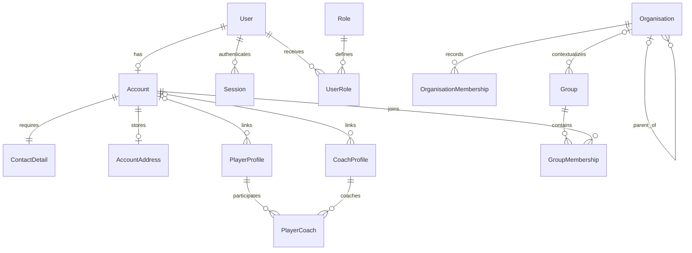
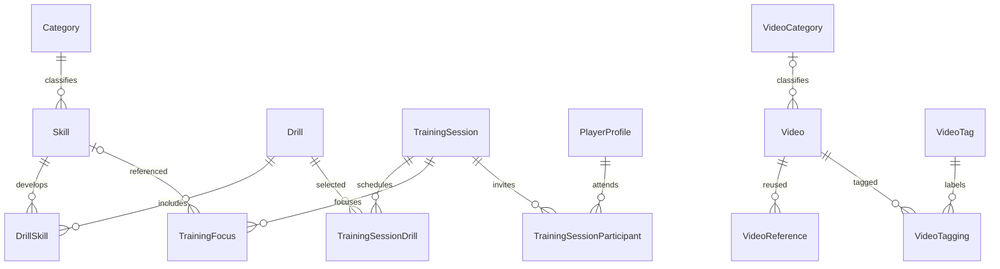
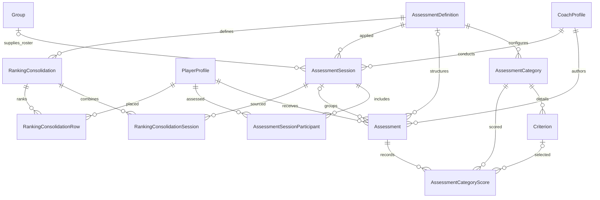

# Model relationships

[Architecture index](architecture.md) · [Complete catalogue](models.md)

These diagrams show domain relationships rather than every SQL column. `o|` means
zero or one and `o{` means zero or many. Optional associations, polymorphic references,
validation and database constraints must be read together; Rails `has_one` alone
does not create a child row.

## Identity, organisations and profiles

`OrganisationMembership.memberable` is a polymorphic reference to exactly one
Account, PlayerProfile or CoachProfile. It also retains optional `account_id`
compatibility. The uniqueness scope is organisation + memberable type + memberable
ID. A group roster instead joins Group directly to Account. Group-to-organisation
association is optional; memberships and assessment rosters are different records.

`PlayerCoach` is a dated coaching period, not an assessment permission grant.
Ending a period preserves it; a later period can be recorded without deleting history.
`PlayerClaim` and `ClaimInvitation` target either profile kind. `ProfileMerge` records
source and canonical profiles of the same kind, plus the acting account and reason.

## Content and training

A TrainingFocus uses a skill or custom text. A VideoReference's polymorphic
`referenced` target is a Skill, Drill or TrainingSession; timestamps and context
belong on the reference. Deleting a reference does not delete its shared Video.
Deleting a Video destroys its references, so that operation has broader consequences.

## Assessment and ranking

An AssessmentCategory selects a catalogue Category or a CategoryCustom; the model
validates its source. An Assessment may also refer to a training session and may
use a standalone category instead of an AssessmentDefinition. Individual category
scores can be criterion-specific; partial unique indexes distinguish those from
category-level scores.

Rankings include stored source snapshots and result rows. JSON snapshots are not
ordinary foreign keys: profile merging intentionally avoids rewriting all historical
JSON. Referential checks must therefore include both associations and snapshot use.

## Deletion is domain-specific

Models use a mixture of destroy, nullify and restrict dependencies. For example,
removing a training session destroys its roster/focus/drill links but nullifies its
assessments' training-session link. Profiles restrict deletion when protected history
exists. Controller/service rules can be stricter than association declarations.
Consult [lifecycles](system_lifecycle.md) before choosing a deletion operation.
