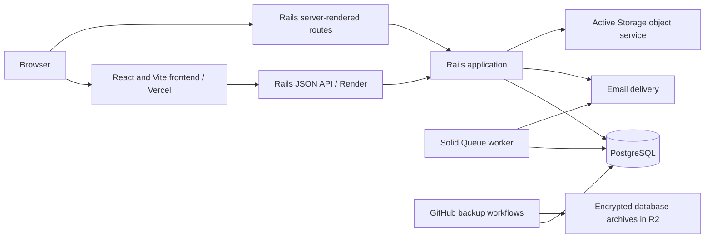

# System architecture

[Architecture index](architecture.md)

## Components and boundaries

The frontend is a separate repository (`beachvolleyballproject`) using React,
TypeScript, Vite and React Router. Its `src/api.ts` owns the API base URL and common
request handling. The API repository runs Rails 8.1 with Puma and PostgreSQL.
The deployment diagram reflects the documented Vercel/Render arrangement; inspect
provider settings to verify an actual deployment.

Rails is not JSON-only: [routes](../../config/routes.rb) also expose server-rendered
skills, drills, training, account, login and admin pages. Both surfaces use the same
models, but their controllers can have different authentication and response behavior.

## Request lifecycle

1. React selects an endpoint under `/api/v1`, supplies the login bearer token when
   present, and supplies `X-Test-Access-Token` if the private test gate is enabled.
2. Routing selects an API controller. The API base controller resumes a session
   but does not require a logged-in user for every browsing endpoint.
3. Endpoint-specific authorization checks the action, role and resource. Visibility
   scopes and profile policies constrain what the caller can inspect or modify.
4. Controllers filter input. Models validate data and services coordinate operations
   that span rows, such as claim approval, profile merging or session publication.
5. Active Record persists to PostgreSQL. Transactions and database constraints
   supplement Ruby validation; an HTTP success is returned after the operation succeeds.
6. The response is serialized to JSON; the frontend updates the page or displays errors.

Do not infer write access from a successful public read. The API skips Rails CSRF
protection and currently permits wildcard CORS; those are configuration facts, not
an authorization guarantee. Session and permission checks still matter.

## Persistence, jobs and integrations

[Database configuration](../../config/database.yml) gives production primary, cache,
queue and cable connections the same `DATABASE_URL`. Solid Cache, Solid Queue and
Solid Cable use database tables; they do not imply a Redis dependency. The separate
`bin/jobs` process consumes queued work, including password-reset and claim-decision
emails. Some mail paths deliver directly, so not every message requires the worker.

[Mail transport selection](../../lib/mail_transport.rb) supports Brevo, Resend, SMTP
and local files. It selects a transport at boot and can fall back when credentials
are absent. Development file delivery writes to `tmp/mails`. Operational verification
must check actual delivery as well as boot success.

[Active Storage](../../config/storage.yml) stores attachment metadata in PostgreSQL
and file bytes separately. Current development selects R2, production selects
Supabase, and tests select disk. Organisation logos are returned as relative
`/rails/active_storage/...` proxy paths. The Vite dev server forwards those routes;
Vercel also needs the routing documented in the setup guide.

External videos usually remain at their providers. `Video` normalizes media metadata;
provider adapters determine safe embed and external URLs. A `VideoReference` records
where the video is used, rather than copying the video for each drill or skill.

## Local versus hosted execution

Locally, Vite listens on HTTP 5174 and proxies `/api` and `/rails` to Puma's HTTPS
127.0.0.1:3001 listener. On Vercel, `VITE_API_BASE_URL` is embedded during the build;
there is no Vite development proxy. Render must expose an HTTP listener on its supplied
port behind platform TLS. The current Puma file binds local SSL unconditionally;
use the documented deployment start command rather than assuming a plain server
command handles both environments.

Database backup workflows are independent of runtime traffic. They read the selected
provider database, encrypt dumps with age and store them in a backup R2 bucket.
They do not back up attachment bytes. See the [setup guide](../LOCAL_VERCEL_RENDER_SETUP.md)
and [recovery runbook](../DATABASE_BACKUP_AND_RESTORE.md) for commands and limitations.
