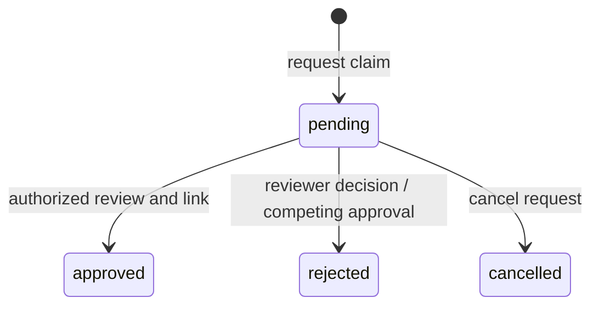
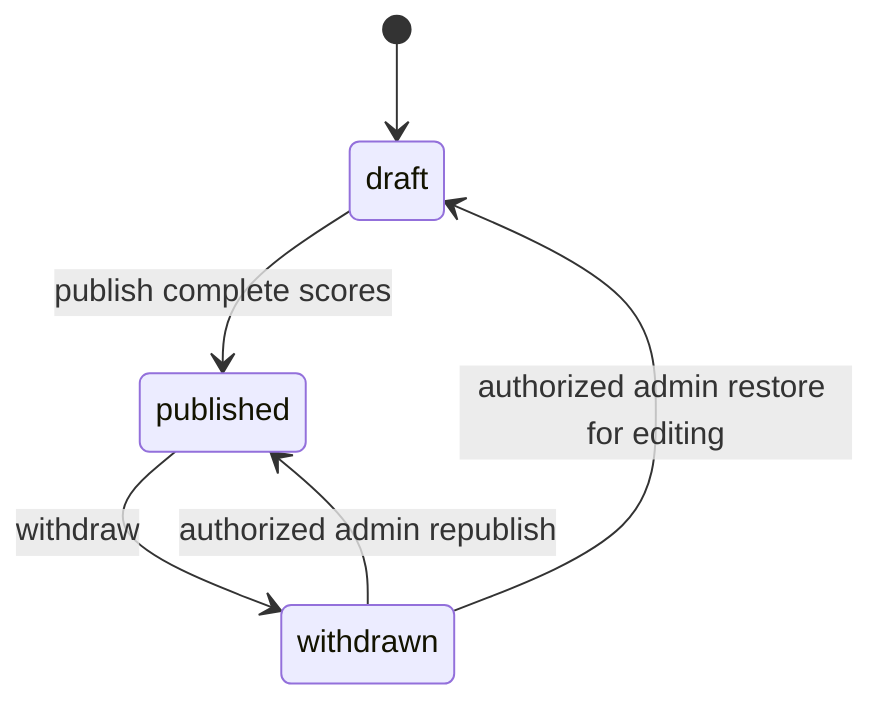

# System and data lifecycles

[Architecture index](architecture.md)

State names below come from the implementation. A status inclusion list is not a
complete transition state machine: action authorization, services, callbacks and
validation determine which changes are allowed. Diagrams show the named workflows,
not permission to set arbitrary status values directly.

## Startup and requests

Rails loads configuration, initializes database-backed services and chooses mail
transport. Puma accepts web requests; a separate production worker consumes queued
jobs. React loads its build-time API URL, checks test access when enabled, restores
login state and requests page data. Requests pass through routing, authentication,
authorization, input validation and persistence before returning JSON. See
[system architecture](system_architecture.md).

## Registration and login

1. Registration validates name, email and password, creates User + Account +
   ContactDetail transactionally, and attempts to assign the player role.
2. If email verification is required, the response is pending verification (202)
   and no login session is issued. A verification token is stored as a digest,
   checked for expiry and cleared on successful use.
3. Otherwise, an API-grant signup can issue a Session token. Login uses the same
   user identity; password-reset delivery may be queued.
4. Session expiry/logout removes session access. The test-access token remains a
   separate gate and does not replace login.

## Profile creation, claim and invitation

A staff-created profile begins with a display name and optional account link.
Creator attribution is stamped server-side. Being accountless does not prevent
training participation or assessment history.

PlayerClaimService verifies the pending state, reviewer authority and claimant,
then links the existing profile in a transaction and records the review. Approval
requires a verification method. Claim-decision mail is queued separately.

Invitation states are `active`, `used`, `revoked`, `expired` and `declined`.
ClaimInvitationService handles issue, redemption/acceptance, decline and revocation;
expiry is also checked against time, so a stored `active` label alone does not prove
redeemability. Successful linking stamps `used_by` and `used_at`. Archiving the
subject expires old links or revokes still-live ones.

## Archive, restore, merge and hard delete

Player/coach profiles use `active` and `archived`. ProfileArchiveLifecycle manages
`archived_at` and invalidates open invitations. Ordinary archived records can be
restored through permitted updates; merged records retain their canonical link and
must not be treated as ordinary reversible archives.

ProfileMergeService requires an authorized admin/curator, a reason, distinct active
profiles of the same type, and equal linked-account IDs (including both unlinked).
It locks the records, rejects pending claims and conflicting references, moves its
explicit list of domain references, then archives the source and writes ProfileMerge.
Historical JSON and membership references are not indiscriminately rewritten.

ProfileDeletionBlocker checks assessments, participation, coaching, ranking snapshots,
claims, invitations and other protected references. Hard delete is a narrow authorized
operation; it is not the normal way to retire a profile or erase its history.

## Membership and coaching periods

Organisation memberships have `pending`, `active`, `suspended`, `ended` states;
group memberships have `pending`, `active`, `ended`. Joining may require approval.
Approval/rejection and end actions operate on membership rows, not login accounts.
An ended organisation membership carries `left_at`. Organisation and Group also
have their own active/archived state, independent of member state.

PlayerCoach records a start/end-dated relationship. Ending it does not retract prior
assessments. Routes deliberately provide `end_relationship` rather than destroy.

## Content and training

Create reusable Category/Skill and Drill records, connect them through DrillSkill,
and attach VideoReferences as needed. Video normalization and provider adapters
supply playback metadata; deleting a contextual reference leaves the Video reusable.

TrainingSession statuses are `draft`, `scheduled`, `cancelled`, `completed`.
Managers see drafts; non-managers see shared non-drafts and eligible private
participation. Current participation lookup uses the account's first player profile,
which is a limitation when an account has multiple profiles.

TrainingSessionParticipant states are `invited`, `confirmed`, `declined`, `attended`,
`absent`. A player is unique within a session; a cancelled session cannot receive
new participants. These labels capture participation/attendance independently of
the session status. The code does not imply an automatic timed transition to completed.

## Scoring and publication

AssessmentDefinition uses `draft`, `active`, `archived`. Categories, weights and
optional criteria define reusable scoring. Standalone Assessment uses `draft`,
`active`, `withdrawn`; public assessment history includes active results, subject
to visibility. There is no assessment destroy route.

Assessment sessions collect participants and draft assessments through creator,
roster and score-grid services. RatingScale and CategoryScoreRollup handle score
normalization/rollup; AssessmentSessionRanking computes session results.

AssessmentSessionPublisher rejects incomplete included players and publishes the
session plus draft assessment rows in a transaction. A withdrawn session cannot
bypass restoration by calling publish. Restorer services accept an explicit draft or published destination. Republishing
revalidates publication; a refused republish leaves the record in draft for correction.
Draft deletion follows edit permissions. The current controller also allows separate
admin deletion paths for withdrawn and published sessions; withdrawal is the ordinary
way to retract published evidence. Route comments claiming draft-only deletion are stale.

RankingConsolidation also uses draft/published/withdrawn. Builder/publisher services
combine source sessions, require eligible published sources for publication, and
freeze snapshots/results. Withdrawal is reversible via the restoration path.
Recalculation is the supervised exception that refreshes a published consolidation
when source eligibility changes; do not assume results automatically follow all
later source edits. Published deletion has a separate admin restriction.

## Deployment, backup and recovery

Deploy the frontend build and compatible API revision, migrate the primary and
Solid service tables, start web/worker processes, and verify API, mail and media.
Daily encrypted backups, weekly disposable restores and freshness monitoring are
separate workflows. For an incident, choose a known-good snapshot, restore into a
replacement database, validate business records and migrations, then update every
web/worker connection before resuming writes. Review restored queued jobs before
running them again. Database recovery does not recover attachment bytes.

Use the [setup guide](../LOCAL_VERCEL_RENDER_SETUP.md) and
[backup runbook](../DATABASE_BACKUP_AND_RESTORE.md) for the executable procedures.
